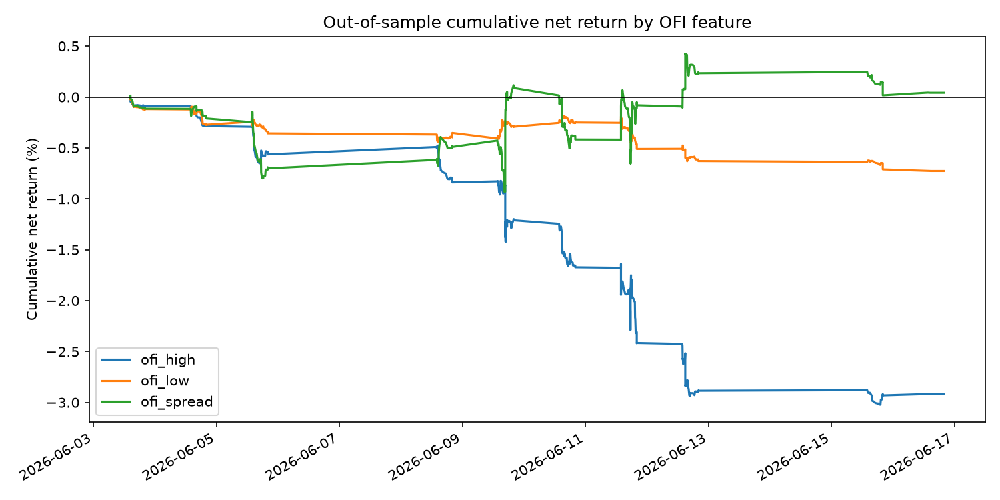
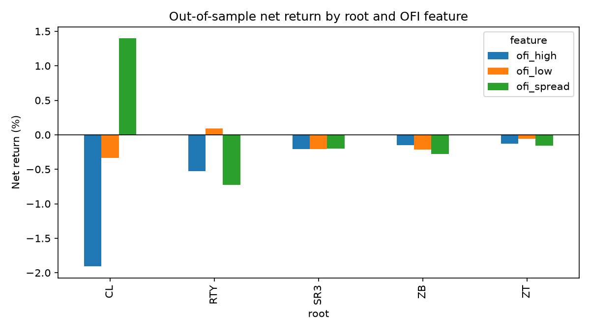

## Status

Initial run completed on 2026-06-22. Status: reject.

## Question

Does low-size trade order-flow imbalance carry useful next-bar information after
the data is organized in volatility time?

## Method

This experiment tests `ofi_low` on candidate roots `SR3`, `ZT`, `ZB`, `CL`, and
`RTY`. Trade-size thresholds and volatility-clock thresholds are estimated from
the training dates only. Signals are generated from completed volatility bars
and applied to the next volatility bar with turnover costs.

## Result

Primary `ofi_low` failed the preregistered out-of-sample criteria.

| Feature | Observations | Gross return | Cost | Net return | Mean net bps/bar | Event t-stat | Hit rate |
|---|---:|---:|---:|---:|---:|---:|---:|
| `ofi_low` | 355 | -0.26% | 0.47% | -0.73% | -0.205 | -2.43 | 32.7% |
| `ofi_high` | 355 | -2.11% | 0.80% | -2.92% | -0.822 | -2.88 | 29.6% |
| `ofi_spread` | 355 | 0.92% | 0.88% | 0.04% | 0.012 | 0.04 | 35.5% |

`ofi_low` was positive for only one of five roots:

| Root | Net return | Event t-stat | Hit rate |
|---|---:|---:|---:|
| `CL` | -0.33% | -1.83 | 34.5% |
| `RTY` | 0.09% | 0.44 | 45.2% |
| `SR3` | -0.21% | -7.17 | 3.4% |
| `ZB` | -0.21% | -1.81 | 40.0% |
| `ZT` | -0.06% | -2.81 | 23.1% |

Artifacts:

- `results.json`
- `root_metrics.csv`
- `pooled_metrics.csv`
- `train_coefficients.csv`
- `root_diagnostics.csv`
- `root_bar_returns.parquet`
- `volatility_bars.parquet`

## Decision

Reject. The validation does not support the claim that low-size OFI on
volatility-clock bars carries standalone next-bar information after costs in
this sample. The spread control was roughly flat after costs, but its event
t-statistic was near zero, so it remains an exploratory diagnostic rather than a
tradable signal.
