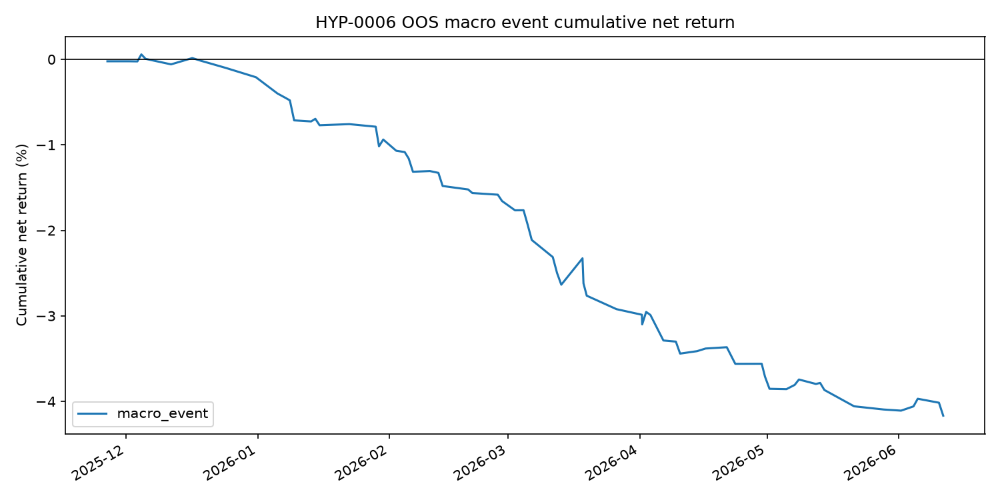

## Status

Run completed on 2026-06-22. Status: reject.

## Run

```bash
uv run python scripts/run_suggested_strategy_experiments.py \
  experiments/HYP-0006-macro-event-drift/config.yaml
```

## Result

Equal-weight event portfolio:

| Observations | Gross | Cost | Net | Mean net bps/event | Event t-stat | Hit rate |
|---:|---:|---:|---:|---:|---:|---:|
| 72 | -2.14% | 2.02% | -4.17% | -5.79 | -4.77 | 27.8% |

Only one of eight roots with usable event features was positive after costs:
`NQ` netted `+2.41%`. The largest drag was `CL`, at `-23.28%` net.



## Decision

Reject. The post-5-minute macro-event drift/reversal rule failed all
preregistered criteria and was net negative before costs as well.
