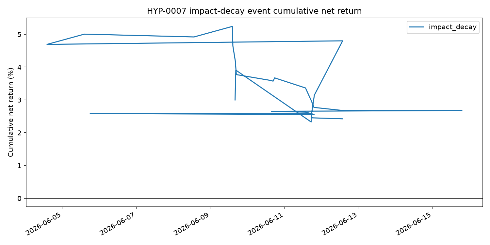

## Status

Run completed on 2026-06-22. Status: reject.

## Run

```bash
uv run python scripts/run_suggested_strategy_experiments.py \
  experiments/HYP-0007-vol-clock-impact-decay/config.yaml
```

## Result

Pooled extreme high-size OFI events:

| Observations | Gross | Cost | Net | Mean net bps/trade | Event t-stat | Hit rate |
|---:|---:|---:|---:|---:|---:|---:|
| 32 | 3.38% | 0.96% | 2.42% | 7.57 | 0.59 | 31.2% |

The training-set direction selected `fade` for all five roots. Out of sample,
`CL` was strongly positive, `ZB` was slightly positive, and `RTY`, `SR3`, and
`ZT` were negative.



## Decision

Reject. The pooled result was positive, but the sample had only 32 test trades,
the t-statistic was far below the threshold, and only 40% of roots were positive.
This remains a lead for a longer-history test, not evidence of positive
expectancy.
