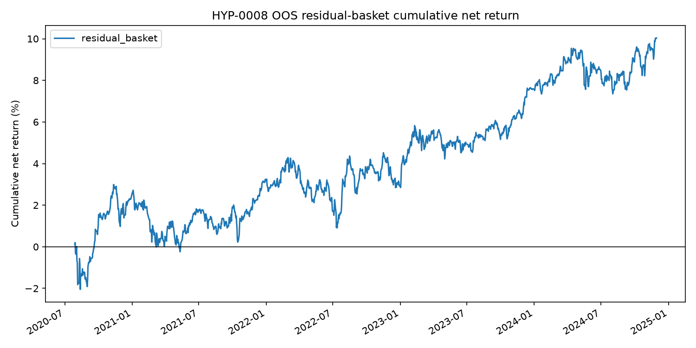

## Status

Run completed on 2026-06-22. Status: reject.

## Run

```bash
uv run python scripts/run_suggested_strategy_experiments.py \
  experiments/HYP-0008-cross-asset-residual-baskets/config.yaml
```

## Result

Daily residual basket out of sample:

| Observations | Gross | Cost | Net | Mean net bps/day | Event t-stat | Sharpe | Hit rate |
|---:|---:|---:|---:|---:|---:|---:|---:|
| 1,351 | 13.72% | 3.69% | 10.04% | 0.74 | 1.45 | 0.63 | 51.6% |

Group-level net returns:

| Group | Net | Event t-stat |
|---|---:|---:|
| Currencies | 5.87% | 0.79 |
| Equities | -2.64% | -0.26 |
| Fixed income | -4.47% | -0.73 |
| Metals | 38.75% | 1.64 |



## Decision

Reject under the preregistered rule because the portfolio t-statistic was below
1.65. This is the best-looking result in the batch, but it is concentrated in
metals and needs robustness checks before being treated as an edge.
