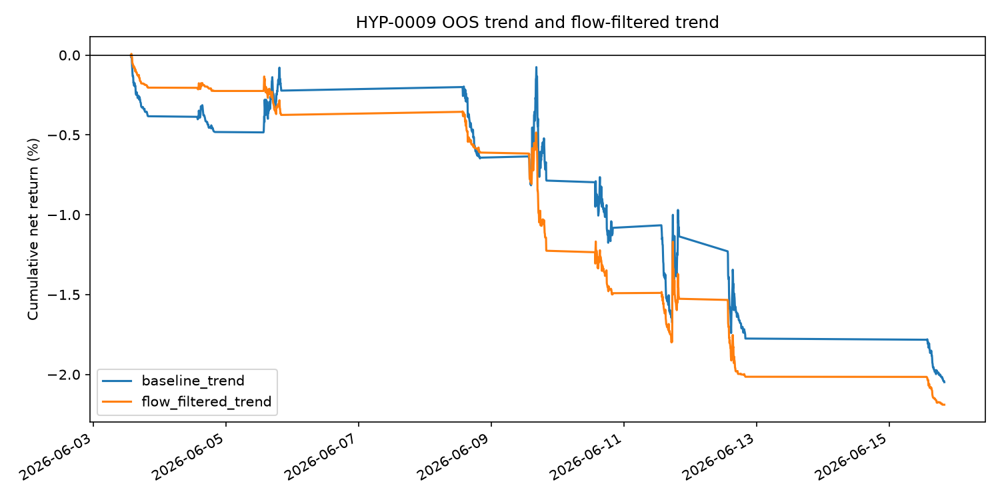

## Status

Run completed on 2026-06-22. Status: reject.

## Run

```bash
uv run python scripts/run_suggested_strategy_experiments.py \
  experiments/HYP-0009-trend-flow-filter/config.yaml
```

## Result

| Method | Observations | Gross | Cost | Net | Mean net bps/bar | Event t-stat | Hit rate |
|---|---:|---:|---:|---:|---:|---:|---:|
| Baseline trend | 702 | -0.09% | 1.96% | -2.05% | -0.29 | -1.82 | 36.0% |
| Flow-filtered trend | 702 | 0.05% | 2.24% | -2.19% | -0.31 | -2.74 | 26.6% |



## Decision

Reject. Flow confirmation did not rescue the short-window intraday trend rule;
it slightly improved gross return but increased costs and underperformed the
baseline after costs.
