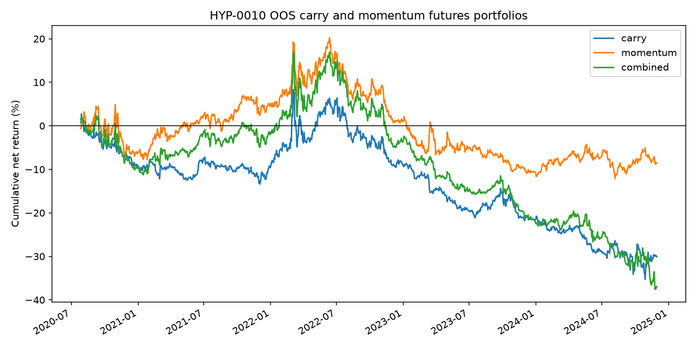

## Status

Run completed on 2026-06-22. Status: reject.

## Run

```bash
uv run python scripts/run_suggested_strategy_experiments.py \
  experiments/HYP-0010-futures-carry-momentum/config.yaml
```

## Result

Out-of-sample daily portfolio metrics:

| Method | Observations | Gross | Cost | Net | Mean net bps/day | Event t-stat | Sharpe | Hit rate |
|---|---:|---:|---:|---:|---:|---:|---:|---:|
| Carry | 1,352 | -19.64% | 10.43% | -30.07% | -2.22 | -1.31 | -0.56 | 46.2% |
| Momentum | 1,352 | -6.59% | 1.95% | -8.54% | -0.63 | -0.33 | -0.14 | 53.2% |
| Combined | 1,352 | -28.38% | 8.55% | -36.93% | -2.73 | -1.34 | -0.58 | 49.7% |

Carry was reconstructed for all 15 roots from raw front/next daily contract
history over 2010-06-06 to 2024-11-29.



## Decision

Reject. The combined carry-plus-momentum baseline was negative before and after
costs. The simple carry sign convention used here is likely too naive across
asset classes, but the tested implementation does not show positive expectancy.
