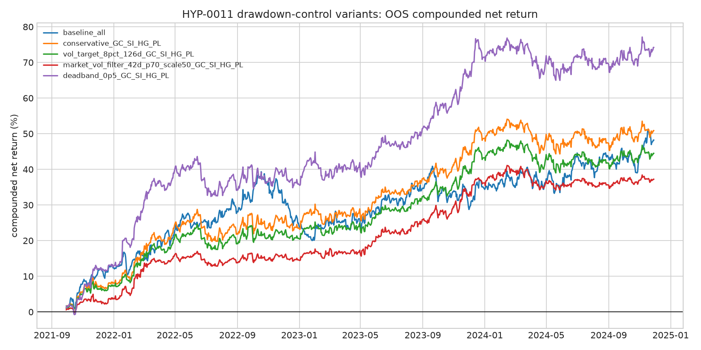
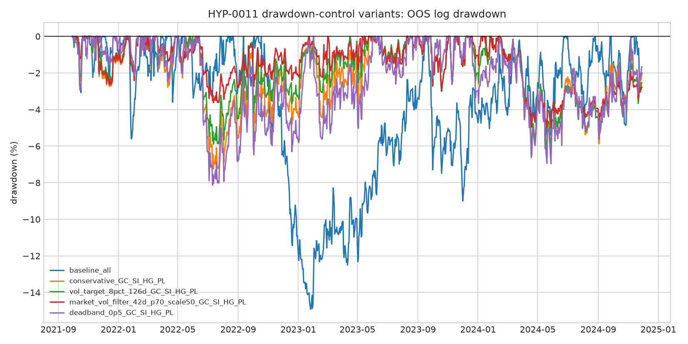

## Objective

Find ways to reduce the OOS drawdown of the expanded metals residual basket
without eliminating the strategy's positive expectancy.

Baseline universe: `GC`, `SI`, `HG`, `PL`, `PA`, `ALI`.

OOS window: `2021-09-29` to `2024-11-29`.

## Main Result

The most defensible structural change is to remove `PA` and `ALI`, leaving
`GC`, `SI`, `HG`, and `PL`.

This four-metal basket keeps the core precious/industrial metals relationship,
cuts OOS max drawdown by about half, improves the OOS t-statistic, lowers cost
drag, and is also positive in the training window.

| Variant | OOS CAGR | OOS t-stat | OOS Sharpe | OOS max drawdown | OOS Calmar | OOS cost |
|---|---:|---:|---:|---:|---:|---:|
| Baseline `GC/SI/HG/PL/PA/ALI` | 13.23% | 1.85 | 0.94 | -14.92% | 0.89 | 5.50% |
| Conservative `GC/SI/HG/PL` | 13.87% | 2.23 | 1.13 | -7.25% | 1.91 | 3.34% |
| `GC/SI/HG/PL` + 8% vol target | 12.32% | 2.30 | 1.16 | -6.41% | 1.92 | 2.94% |
| `GC/SI/HG/PL` + high-vol 50% scale | 10.51% | 2.49 | 1.26 | -5.00% | 2.10 | 2.50% |
| `GC/SI/HG/PL` + `0.5` z-score deadband | 19.15% | 2.74 | 1.39 | -8.14% | 2.35 | 4.02% |

## Why This Helps

The baseline's worst OOS drawdown ran from `2022-10-18` to `2023-01-26` and was
`-14.92%` in log-return terms.

Gross contribution during that drawdown:

| Root | Gross contribution |
|---|---:|
| `PA` | -5.41% |
| `PL` | -4.32% |
| `SI` | -4.04% |
| `HG` | -3.50% |
| `GC` | -0.31% |
| `ALI` | 4.42% |

`PA` is not the only contributor to the drawdown, but it has the largest
negative contribution and the highest absolute contribution share in the
baseline OOS period. Removing `PA` is therefore the first drawdown control to
test more rigorously.

## Interpretation

Recommended next version:

1. Use `GC`, `SI`, `HG`, and `PL`.
2. Keep the same residual mean-reversion signal.
3. Add either:
   - an 8% trailing volatility target if the goal is balance, or
   - a high-volatility regime scaler if the goal is maximum drawdown reduction.

The `GC/SI/HG/PL/ALI` no-`PA` variants looked excellent OOS, especially with a
post-roll pause, but they were negative in the training window. Treat those as
research leads, not as a production change.

## Artifacts

- Full scan: `drawdown_variant_scan.csv`
- Selected metrics: `drawdown_control_selected_metrics.csv`
- Selected OOS returns: `drawdown_control_selected_returns.csv`
- Equity comparison: `drawdown_control_equity_comparison.png`
- Drawdown comparison: `drawdown_control_drawdown_comparison.png`
