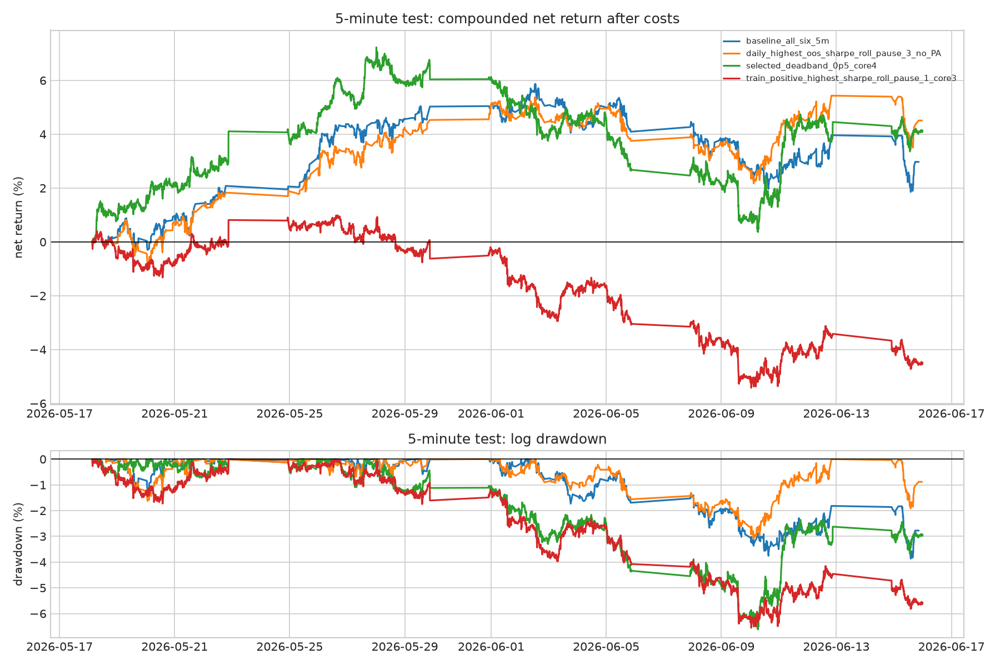
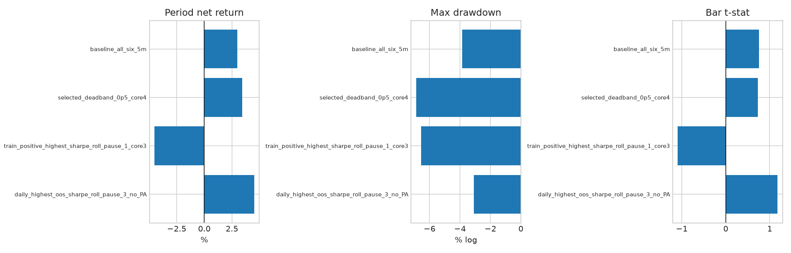

## Objective

Test the highest OOS-Sharpe daily variant on the available 5-minute metals data.

Literal highest OOS-Sharpe daily variant:

- Roots: `GC`, `SI`, `HG`, `PL`, `ALI`
- Excludes: `PA`
- Signal: residual mean reversion
- Lookback: `126` observations
- Clip: `+/-2` z-score
- Roll control: pause each root on roll bars plus `3` following bars
- Cost: `1.5` bps per unit turnover

## 5-Minute Translation

The test uses common 5-minute timestamps across the required roots and recomputes
forward returns from continuous log prices on that common grid. This avoids
mixing root-local return intervals with cross-asset portfolio timestamps.

The sample is short: `2026-05-18 14:35 UTC` to `2026-06-15 23:30 UTC` after
warmup.

## Main Result

| Variant | Roots | Eval bars | Net log return | Compounded return | Bar t-stat | Sample annualized Sharpe | Max drawdown | Cost drag |
|---|---|---:|---:|---:|---:|---:|---:|---:|
| Highest daily Sharpe, 5m translation | `GC/SI/HG/PL/ALI` | 1,485 | 4.41% | 4.51% | 1.18 | 4.23 | -3.09% | 4.59% |
| Highest train-positive daily Sharpe | `GC/SI/HG` | 5,719 | -4.62% | -4.51% | -1.09 | -3.88 | -6.55% | 15.65% |
| Selected deadband variant | `GC/SI/HG/PL` | 5,660 | 3.35% | 3.41% | 0.73 | 2.60 | -6.87% | 23.28% |
| Six-metal baseline | `GC/SI/HG/PL/PA/ALI` | 1,400 | 2.93% | 2.97% | 0.75 | 2.71 | -3.87% | 4.10% |

## Sensitivity

For the literal highest-Sharpe daily variant, the 5-minute result is strongest at
shorter lookbacks and deteriorates at longer lookbacks.

| Lookback bars | Cost bps | Net log return | Compounded return | Bar t-stat | Max drawdown |
|---:|---:|---:|---:|---:|---:|
| 63 | 0.0 | 11.20% | 11.85% | 2.90 | -2.09% |
| 63 | 1.5 | 4.86% | 4.98% | 1.26 | -2.91% |
| 63 | 3.0 | -1.49% | -1.48% | -0.39 | -4.48% |
| 126 | 0.0 | 9.00% | 9.42% | 2.41 | -2.30% |
| 126 | 1.5 | 4.41% | 4.51% | 1.18 | -3.09% |
| 126 | 3.0 | -0.18% | -0.18% | -0.05 | -4.22% |
| 252 | 1.5 | -1.58% | -1.57% | -0.41 | -5.59% |
| 504 | 1.5 | -1.90% | -1.88% | -0.49 | -5.80% |

## Interpretation

The direct 5-minute translation is positive after the assumed `1.5` bps turnover
cost, but the evidence is not strong enough to call it validated:

- The post-warmup sample is only about one month.
- The bar-level t-stat is `1.18`, below a normal research threshold.
- Costs are a major part of the result; at `3.0` bps the `126`-bar version is
  roughly flat to negative.
- The signal works better at short 5-minute lookbacks than at longer lookbacks,
  so it should be treated as an intraday variant rather than a simple frequency
  conversion of the daily strategy.

Next useful test: pull a longer 5-minute history from Databento for the
`GC/SI/HG/PL/ALI` universe and rerun the same fixed `63`/`126` bar variants
without reselecting parameters on the current month.

## Artifacts

- Metrics: `five_min_high_sharpe_variant_metrics.csv`
- Returns: `five_min_high_sharpe_variant_returns.csv`
- Positions: `five_min_high_sharpe_variant_positions.parquet`
- Sensitivity: `five_min_highest_sharpe_lookback_cost_sensitivity.csv`
