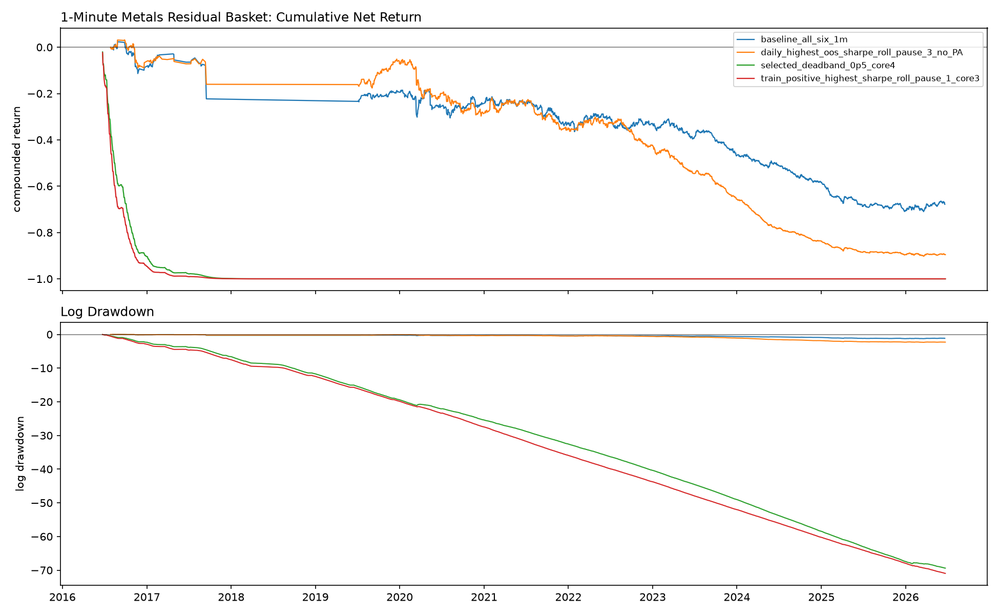
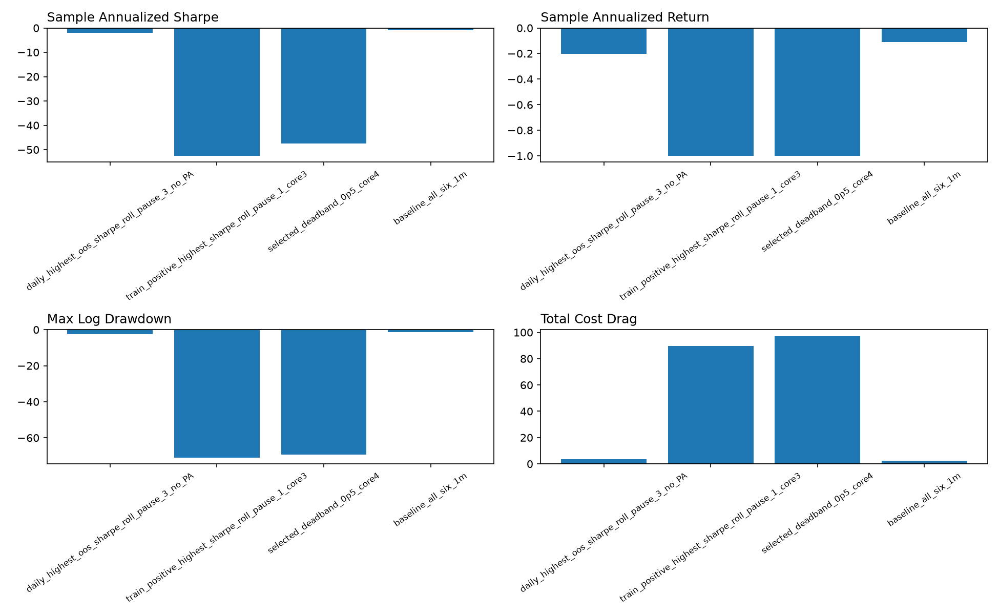

## Objective

Retest the fixed HYP-0011 metals residual mean-reversion variants on the newly
downloaded 10-year `ohlcv-1m` continuous metals data.

The implementation keeps the 5-minute retest mechanics: common timestamps across
the variant roots, residual log prices, rolling z-scores, one-bar forward
returns, `1.5` bps cost per unit turnover, and optional roll-pause/deadband
controls.

## Main Result

Least-negative full-sample Sharpe in this fixed set: `baseline_all_six_1m` with sample
annualized Sharpe `-0.90`.

Selected drawdown-control variant: `selected_deadband_0p5_core4` compounded
`-100.00%` net with sample annualized Sharpe
`-47.50` and max compounded drawdown
`-100.00%`.

| Variant | Roots | Eval bars | Net compounded | Ann. return | T-stat | Sharpe | Max DD | Cost |
|---|---|---:|---:|---:|---:|---:|---:|---:|
| `daily_highest_oos_sharpe_roll_pause_3_no_PA` | `GC/SI/HG/PL/ALI` | 152,228 | -89.55% | -20.40% | -6.20 | -1.97 | -90.79% | 373.39% |
| `train_positive_highest_sharpe_roll_pause_1_core3` | `GC/SI/HG` | 2,931,301 | -100.00% | -99.92% | -165.99 | -52.49 | -100.00% | 8956.04% |
| `selected_deadband_0p5_core4` | `GC/SI/HG/PL` | 2,469,209 | -100.00% | -99.90% | -150.20 | -47.50 | -100.00% | 9720.10% |
| `baseline_all_six_1m` | `GC/SI/HG/PL/PA/ALI` | 101,283 | -67.82% | -10.85% | -2.83 | -0.90 | -72.23% | 247.27% |

## Lookback And Cost Sensitivity

Sensitivity below is for the literal highest daily-Sharpe variant
`GC/SI/HG/PL/ALI`, with `PA` excluded and a 3-bar roll pause. `630` 1-minute bars
is the rough clock-time equivalent of the earlier `126` 5-minute-bar lookback.

| Lookback bars | Cost bps | Eval bars | Net compounded | T-stat | Max DD | Cost |
|---:|---:|---:|---:|---:|---:|---:|
| 63 | 0.0 | 152,260 | 636.61% | 5.52 | -25.01% | 0.00% |
| 63 | 1.5 | 152,260 | -96.23% | -9.05 | -96.36% | 527.51% |
| 63 | 3.0 | 152,260 | -99.98% | -23.58 | -99.98% | 1055.01% |
| 126 | 0.0 | 152,228 | 337.22% | 4.05 | -25.20% | 0.00% |
| 126 | 1.5 | 152,228 | -89.55% | -6.20 | -90.79% | 373.39% |
| 126 | 3.0 | 152,228 | -99.75% | -16.43 | -99.76% | 746.78% |
| 630 | 0.0 | 151,976 | 247.69% | 3.57 | -16.77% | 0.00% |
| 630 | 1.5 | 151,976 | -34.90% | -1.23 | -47.15% | 167.54% |
| 630 | 3.0 | 151,976 | -87.81% | -6.03 | -88.98% | 335.07% |

## Caveats

- Annualization uses the realized common-bar frequency of each variant, so it is
  useful for comparing these 1-minute variants but should not be read as a
  capacity-adjusted production Sharpe.
- `ALI` and `PA` make common timestamps much sparser. Variants including `ALI`
  are tested on a materially different event grid than `GC/SI/HG/PL`.
- The data pull had Databento quality warnings on a small number of dates; this
  retest does not adjust for those dates beyond using the continuous files as
  downloaded.

## Artifacts

- Metrics: `one_min_strategy_metrics.csv`
- Returns: `one_min_strategy_returns.csv`
- Positions: `one_min_strategy_positions.parquet`
- Sensitivity: `one_min_strategy_lookback_cost_sensitivity.csv`
