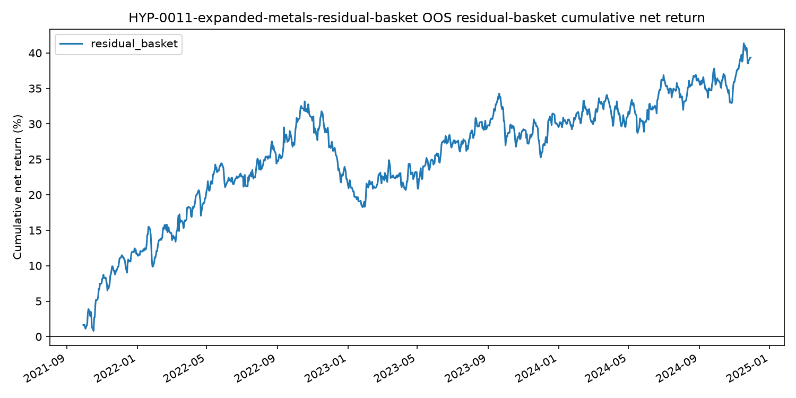

## Status

Status: `revise`.

The expanded metals basket passed the preregistered initial threshold, but it is
not ready for paper trading until the roll and liquidity caveats are tested.

## Run

```bash
uv run python scripts/run_suggested_strategy_experiments.py \
  experiments/HYP-0011-expanded-metals-residual-basket/config.yaml
```

Completed: `2026-06-22T15:11:33Z`.

Universe: `GC`, `SI`, `HG`, `PL`, `PA`, `ALI`.

Data source: Databento `GLBX.MDP3` per-contract `ohlcv-1d`, converted to the
existing volume-roll continuous futures format.

Backtest window starts on `2014-05-06`, the first available `ALI` continuous
date. Out-of-sample begins after the chronological 70% training split.

## Results

| Metric | Value |
|---|---:|
| OOS observations | 985 |
| Gross return | 44.85% |
| Cost drag | 5.50% |
| Net return | 39.35% |
| Mean net return | 3.99 bps/day |
| Daily event t-stat | 1.85 |
| Annualized Sharpe | 0.94 |
| Hit rate | 53.20% |
| Max drawdown | -14.92% |



## Decision

The result is an initial pass under the experiment rule: positive OOS net return
and daily event t-statistic above `1.65`.

Keep status as `revise`, not `paper_trade`, because:

- `ALI` starts later than the original metals panel and has much higher roll
  frequency in the continuous build (`245` rolls, `23.2` per year).
- `PA` has a `6.65%` maximum roll-day move in the build report, which needs
  event-level inspection.
- The Databento pull emitted reduced-quality warnings around several 2014
  dates, which overlap the start of the expanded panel.
- The result should be rerun with one-root exclusion tests, cost sensitivity,
  subperiod splits, and liquidity filters before promotion.
